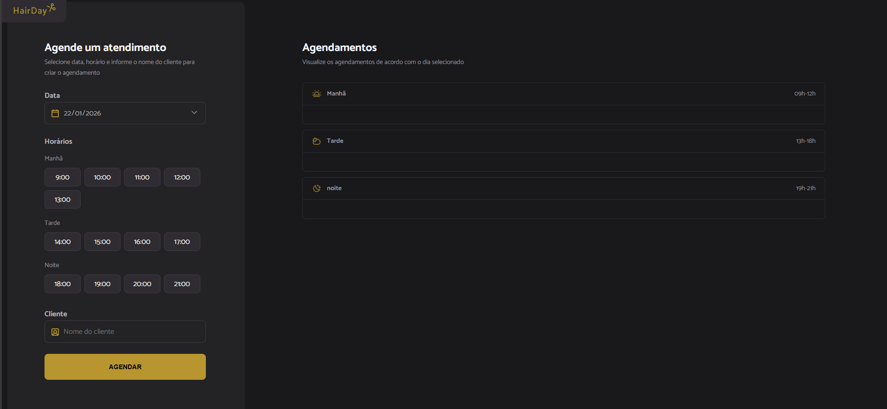
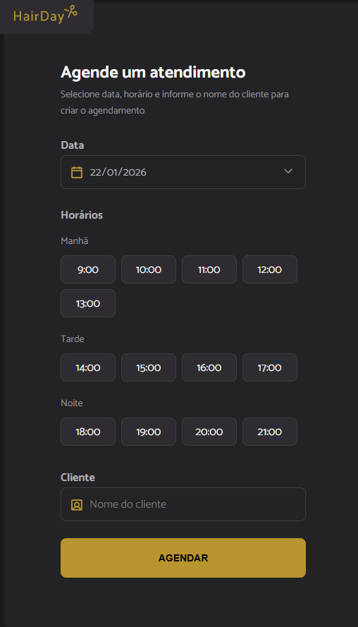

# 💈 HairDay — Sistema de Agendamento para Barbearia

Aplicação web para agendamento de horários em uma barbearia, desenvolvida durante o **curso Full Stack da Rocketseat**, com foco em organização de código, modularização e boas práticas em JavaScript moderno.

O sistema permite selecionar data, horário disponível e cliente, além de listar e cancelar agendamentos, com persistência via API simulada utilizando **json-server**.

---

## 🖼️ Preview do projeto

### Tela principal


### Seleção de horário


### Lista de agendamentos


---

## 🚀 Funcionalidades

- Seleção de data com calendário
- Listagem dinâmica de horários disponíveis
- Bloqueio automático de horários já agendados
- Agendamento com nome do cliente
- Listagem de agendamentos por período:
  - Manhã
  - Tarde
  - Noite
- Cancelamento de agendamentos
- Atualização automática da interface após alterações
- Integração com API fake (json-server)

---

## 🛠️ Tecnologias utilizadas

- JavaScript (ES Modules)
- Webpack
- Babel
- Day.js
- JSON Server
- HTML5
- CSS3

## ⚙️ Como executar o projeto

### 1️⃣ Instalar dependências

```bash
npm install
```

### 2️⃣ Iniciar o servidor (json-server)

```bash
npm run server
```
### 3️⃣ Iniciar o projeto
```bash
npm run dev
```

## 👨‍💻 Autor

Lucas Moura

Estudante de Análise e Desenvolvimento de Sistemas  
Projeto do Curso Full Stack — Rocketseat
